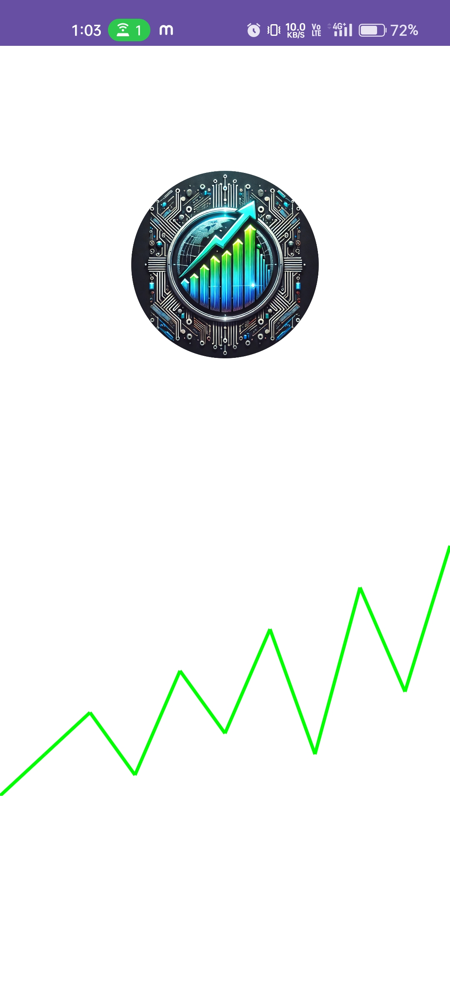
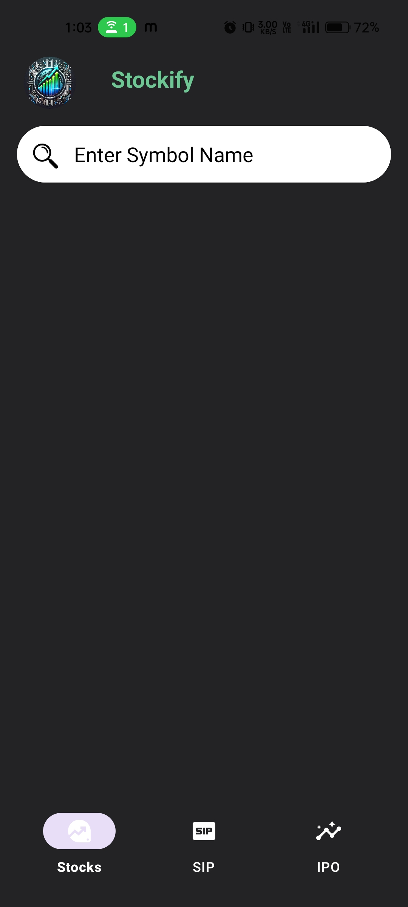
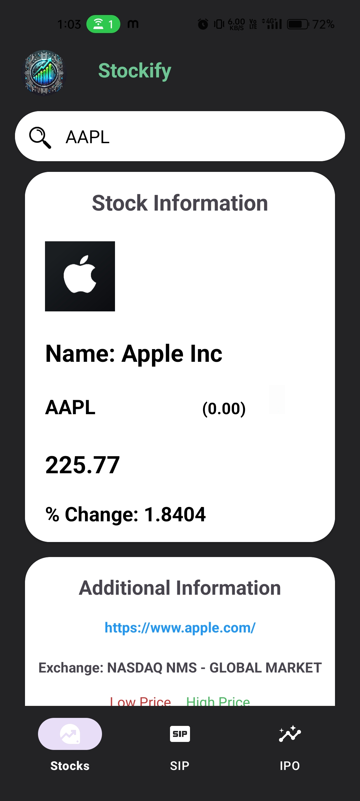

# Stockify

**Stockify** is an intuitive Android application that provides users with real-time stock market data. With a user-friendly interface and dynamic features, users can easily search for stock symbols and view comprehensive information, including current prices, percentage changes, and additional company details.

## Table of Contents

1. [Features](#features)
2. [Screenshots](#screenshots)
3. [Installation Instructions](#installation-instructions)
4. [Usage](#usage)
5. [Code Overview](#code-overview)
6. [License](#license)
7. [Author](#author)

## Features

- **Stock Search**: Effortlessly search for stocks by entering their symbol (e.g., AAPL, TSLA).
- **Real-time Stock Data**: View current stock price, percentage change, high/low prices, open/close prices, and the exchange.
- **Splash Screen Animation**: A visually appealing graph animation is displayed on the splash screen during app launch.
- **Dynamic UI Updates**: The app changes the background color based on price fluctuations (green for price increases and red for decreases) and displays corresponding up/down images.
- **Price Difference**: The app shows the difference between the previous and current prices, providing users with insight into stock performance at a glance.
- **Periodic Updates**: The app fetches updated stock information every minute to ensure users receive the latest data.
- **Additional Information**: Display company logos and links to official websites.
- **Error Handling**: Gracefully handles invalid stock symbols and network issues with informative error messages.
- **Loading Indicator**: Shows a loading overlay while fetching data, ensuring a smooth user experience.
- **Bottom Navigation**: Easily navigate between different sections of the app (Stocks, SIP, IPO).
- **Future Navigation**: Navigation between different sections is planned for future implementation.

## Screenshots
<p align="center">
    
    
    
</p>

## Installation Instructions

### Requirements
- Android Studio installed on your machine.
- An API Key from [Finnhub](https://finnhub.io/) or another stock market API.

### Setup
1. **Clone the repository**:
   ```bash
   git clone https://github.com/Arnavjain2503/Stockify.git
   ```
2. **Open the project in Android Studio**.
3. **Add your API key**:
   - Replace the placeholder API key in `StockViewModel.java` with your own:
     ```java
     private static final String API_KEY = "your_api_key";
     ```

4. **Run the app** on an emulator or connected Android device.

## Usage

- **Launch the app**: The app opens with a splash screen displaying an animated graph for 3 seconds before navigating to the main stock lookup screen.
- **Search for stocks**: Enter a stock symbol (e.g., AAPL) in the search bar and tap the search icon.
- **View stock details**: The app displays current prices, percentage changes, high/low prices, company logos, and links to the company’s website.
- **Dynamic Feedback**: The background color changes to green when the stock price increases and to red when it decreases. An up/down image is shown based on the price trend, along with the difference between the previous and current prices for quick visual feedback.
- **Periodic Updates**: The app fetches new stock information every minute to keep users updated with the latest market data.
- **Navigate easily**: Use the bottom navigation menu to switch between different sections (Stocks, SIP, IPO).

## Code Overview

### Key Components
- **MainActivity.java**: Manages the main UI, user interactions, and displays fetched stock data.
- **SplashActivity.java**: Shows the splash screen with animation during app launch.
- **GraphView.java**: Custom view for rendering the graph animation on the splash screen.
- **StockViewModel.java**: Handles the business logic, fetching data from the Finnhub API via Retrofit.
- **StockApiService.java**: Defines API endpoints for fetching stock quotes and company profiles.
- **CompanyProfileResponse.java & StockQuoteResponse.java**: Data models for handling API responses.

### XML Files Overview
- **AndroidManifest.xml**: Defines application permissions, components, and metadata.
- **activity_main.xml**: Layout for the main activity, including the search bar and stock data display.
- **activity_splash.xml**: Layout for the splash screen, showing branding or animations during launch.
- **graph_anim.xml**: Defines the custom view for rendering animated graphs on the splash screen.
- **bottom_nav_menu.xml**: Specifies the items and icons for the bottom navigation bar.

### API Integration
- The app integrates with the [Finnhub API](https://finnhub.io/) to fetch real-time stock data, company profiles, and additional information.
- **Retrofit** is utilized for making efficient network requests with appropriate error handling.

### Permissions
The app requires the following permission:
```xml
<uses-permission android:name="android.permission.INTERNET" />
```

### Retrofit 2 Dependencies
The App uses following Retrofit 2 dependencies in `build.gradle` (Module: app) file:
```groovy
implementation 'com.squareup.retrofit2:retrofit:2.9.0'
implementation 'com.squareup.retrofit2:converter-gson:2.9.0'
```

### Technologies Used
- **Java** for Android development.
- **Retrofit** for API requests.
- **ViewModel** for maintaining a clean separation of UI and business logic.
- **Glide** for loading images (e.g., company logos).

### Important Note

If the network connection is slow, data fetching from the API will take longer, especially when using an Android Virtual Device (AVD). It's recommended to use AVD with a fast network connection. Alternatively, you can run the app on a physical device by connecting via cable or using the APK for smoother performance.

## License
This project is licensed under the MIT License.

## Author
Arnav Jain
